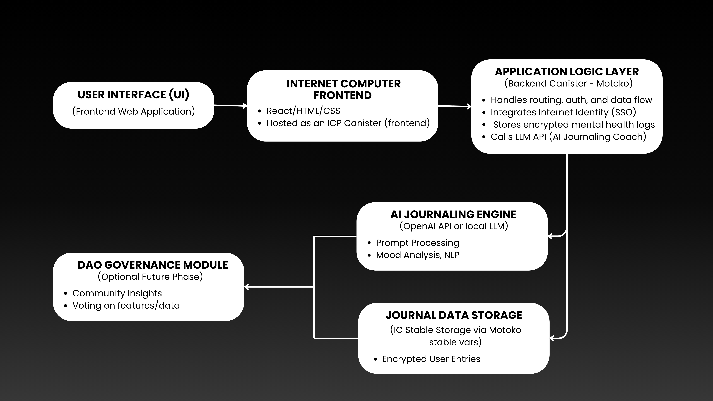

# 🧠 Thynkora-AI

**Thynkora-AI** is a decentralized, AI-powered mental wellness platform built on the **Internet Computer Protocol (ICP)**. It enables users to securely journal their emotions, receive supportive feedback from an empathetic AI, and contribute to the platform’s future through decentralized governance.

Designed with a strong emphasis on **privacy**, **cultural relevance**, and **scalability**, Thynkora-AI offers a mindful alternative to centralized mental health tools that often compromise user data and user agency.

## 📌 Summary

Thynkora-AI empowers users to document their thoughts, feelings, and life journeys through secure, private journaling—while using AI to provide intelligent feedback, reflections, and personal insights. Built with Internet Identity and deployed on ICP canisters, your data remains fully encrypted and owned by you.

---

## 🚀 Features

- 🤖 **Therapy Chat** – Chat with a culturally aware, supportive AI  
- 📝 **Emotional Journaling** – Write and track your moods in a private journal  
- 🔐 **Decentralized Privacy** – All data is stored securely on ICP canisters  
- 🌍 **Cultural Sensitivity** – AI understands emotional nuances from diverse cultures  
- 🗳️ **Governance Ready** – Community-led roadmap through decentralized voting

---
## 📜 Table of Contents

- [🎥 Recording](#-recording)
- [🧠 Architecture Diagram](#-architecture-diagram)
- [📦 Installation & Setup](#-installation--setup)
- [🖌️ UI/UX Design](#-ui/ux-design)
- [🌐 ICP Deployment Details](#-icp-deployment-details)
- [🚀 Future Plans (Post-Hackathon)](#-future-plans-(post-hackathon))

---
## 🎥 Recording

To demonstrate the full potential of WellMind AI, we’ve prepared two key video recordings:

- **The Pitch Deck Presentation** provides a strategic overview of the problem we’re solving, our unique decentralized solution, business model, market fit, and our vision for scalability and impact.

- **The Product Demo + Code Walkthrough** showcases the actual working prototype — including how users interact with the platform, how the AI and blockchain components work together, and a look into our development process and architecture.

🎞️ Pitch Deck Presentation
📍 [Watch here]
[Pitch Deck](https://www.canva.com/design/DAGuG4ZDliA/hxY6RfLXKMF4eDfgXmgi-Q/edit?utm_content=DAGuG4ZDliA&utm_campaign=designshare&utm_medium=link2&utm_source=sharebutton)

### Brief Architecture Overview:
- Users write entries → stored via backend canister
- AI summarizes thoughts, suggests patterns
- DAO governs user decisions (features, AI training goals)

💻 Product Demo + Code Walkthrough
📍 [Watch here](https://drive.google.com/file/d/1GYeR2iFpXIqB1djNGFNBhgXygCw6mzT_/view?usp=sharing)

---
## 🧠 Architecture Diagram

Thynkora AI is designed as a decentralized journaling platform that merges AI-driven reflection with secure identity and governance. Built on the Internet Computer Protocol (ICP), it prioritizes user privacy, data ownership, and community-led development.

---

### 🔧 System Components

| Component             | Description                                                                 |
|-----------------------|-----------------------------------------------------------------------------|
| **Frontend (React)**  | A responsive journaling interface hosted as an ICP asset canister.         |
| **Canisters (Backend)** | Smart contracts handle journal logic, DAO governance, and AI request routing. |
| **Internet Identity** | Enables secure, anonymous, and user-owned authentication.                  |
| **AI Assistant (LLM)**| Processes journaling prompts and returns reflective guidance.              |
| **DAO Governance**    | Users propose, vote, and influence platform evolution.                     |
| **Decentralized Storage** | All journal entries and actions are stored securely in ICP canisters.       |

---

### 🔄 System Workflow

1. **User Authentication**  
   - User logs in using Internet Identity (WebAuthn-based, privacy-first).
2. **Journal Interaction**  
   - User writes or speaks a journal entry on the frontend.
3. **AI Prompting**  
   - The journal is sent to an AI canister, which responds with insights or questions.
4. **Entry Storage**  
   - The final journal entry and AI output are stored in a personal on-chain canister.
5. **DAO Participation**  
   - User can submit/vote on DAO proposals for platform improvements or features.
  
   ### 🧩 Architecture Overview

```plaintext
+------------------------+
|   User (Frontend UI)  |
+-----------+------------+
            |
            v
+------------------------+      +----------------------+
|   Journal Canister     | <--> |  AI Prompt Canister  |
+-----------+------------+      +----------------------+
            |
            v
+------------------------+      +----------------------+
|  DAO Governance Canister| <--> |  Voting Interface    |
+------------------------+      +----------------------+
            |
            v
+------------------------+
| Internet Identity Auth |
+------------------------+
```
### 📌 Architecture Image


---
## 🛠️ Local Development Setup

### ✅ Prerequisites

Install the following tools:

- [Node.js](https://nodejs.org/) (v18 or higher)
- [dfx SDK](https://internetcomputer.org/docs/current/developer-docs/setup/install/)
- [Git](https://git-scm.com/)
- [Vite](https://vitejs.dev/) (installed via npm)

---

### 📦 Installation & Setup
1. **Clone the Repository**
First, clone the project from GitHub and navigate into the directory:
```bash
git clone https://github.com/AcademiTechResearchAndKnowledge/Thynkora-AI.git
cd Thynkora-AI
```
2. **Stop Any Running DFX Processes**
Make sure no conflicting DFX instances are running:

```bash
dfx stop
dfx killall
```
3. **Start the Internet Computer Replica**
Launch a clean local ICP replica in the background:

```bash
dfx start --background --clean
```
4. **Deploy the Canisters**
Deploy the backend canisters and frontend assets:

```bash
dfx deploy
```
5. **Access the App**
Once deployment is successful, open your browser and go to the local URL printed in the terminal (usually something like):
```bash
http://localhost:4943/?canisterId=<frontend_canister_id>
```

### 📁 Project Structure
```
Thynkora-AI/
├── node_modules/                        # Dependency packages installed via npm/yarn

├── src/                                 # Main source code directory
│
│   ├── Thynkora-AI-backend/             #   BACKEND CANISTERS (Motoko)
│   │   ├── ai_therapy/                  # Handles therapy chatbot logic and message processing
│   │   ├── dao_governance/              # DAO logic: proposals, voting, decision-making
│   │   ├── emergency_response/          # Handles emergency support requests and responses
│   │   ├── journal_storage/             # Manages secure journal entries and retrieval
│   │   ├── user_management/             # User accounts, identity handling, authentication
│   │   └── mail_moa/                    # Email notifications and alerts 
│
│   ├── Thynkora-AI-frontend/            #   FRONTEND (React + Vite)
│   │   ├── components/                  # Reusable UI components for different modules
│   │   │   ├── AITherapy/               # Chat UI for interacting with the therapy AI
│   │   │   ├── Auth/                    # Login, signup, and auth-related components
│   │   │   ├── DAO/                     # DAO dashboard UI: proposals, voting, etc.
│   │   │   ├── Emergency/               # Emergency UI components (e.g., SOS or quick contact)
│   │   │   └── Journal/                 # UI for writing and viewing journal entries
│   │
│   │   ├── hooks/                       # Custom React hooks (e.g., useJournal, useAuth)
│   │
│   │   ├── pages/                       # Landing and navigation images for page transitions
│   │   │   ├── AboutUsPage.jpg
│   │   │   ├── ArticlesPage.jpg
│   │   │   ├── CustomerSupportPage.jpg
│   │   │   ├── PTSPage.jpg
│   │   │   ├── landing-bg.jpg
│   │   │   ├── p1.jpg
│   │   │   └── temp/                   # (Optional) Temporary files or drafts
│   │
│   │   ├── public/                      # (Optional)Static public assets (favicons, logo, etc.)
│   │   │   ├── .ic-assets.json5         # (Optional)Internet Computer asset metadata
│   │   │   ├── favicon.ico              # (Optional)Website favicon
│   │   │   └── logo.svg                 # (Optional)App logo
│   │
│   │   ├── src/                         # App logic and entry point
│   │   │   ├── declarations/           # Types and interface declarations
│   │   │   ├── App.tsx                 # Main React component entry
│   │   │   ├── App.scss                # Main global styles
│   │   │   ├── index.scss              # App root styles
│   │   │   ├── main.tsx                # React + Vite root mount script
│   │   │   ├── vite-env.d.ts           # TypeScript env support for Vite
│   │   │   └── utils/                  # Utility functions and helpers
│   │
│   │   └── assets/                     # (Optional) Custom folder for images, fonts, icons
│
├── index.html                          # HTML template used by Vite
├── .env                                # Environment variables (e.g., canister IDs, secrets)
├── .gitignore                          # Git ignore list
├── README.md                           # Project overview and setup instructions
├── dfx.json                            # DFINITY config file (defines canisters, network)
├── package.json                        # Project metadata and dependencies
├── package-lock.json                   # Exact versions of installed npm packages
├── tsconfig.json                       # TypeScript configuration
├── vite.config.ts                      # Vite build/configuration file
```
---
## 🖌️ UI/UX Design

The UI/UX of **WellMind AI** is crafted with clarity, calmness, and ease-of-use at its core—aligning with our mission to provide a safe space for mental wellness.

- 🧘 **Minimalist and Emotionally Soothing Design**  
  A calming color palette and clean layout reduce cognitive load and promote emotional comfort.

- ✍️ **Intuitive Journaling Interface**  
  The journal page is designed to mimic a natural writing flow, focusing on simplicity and accessibility across devices.

- 🧠 **Conversational AI Integration**  
  Users interact with an AI journaling assistant through a chat-style interface, blending familiarity with functionality.

- 🗂️ **Private Entry Dashboard**  
  All entries are organized and accessible with filters, enabling users to review their thoughts while maintaining privacy.

- 📱 **Responsive Design**  
  Fully responsive UI for both desktop and mobile, ensuring accessibility regardless of platform.

- 🔐 **Privacy-First Experience**  
  No login required—users authenticate via Internet Identity and all personal data remains decentralized.

Our UI was designed with mental health and simplicity in mind.  
Explore our [UI/UX folder](tree/main/src/Thynkora-AI-frontend/pages) or view the full Figma prototype:

➡️ [Figma Prototype](https://www.figma.com/design/s709Dz7BrvAxK0WSE2FJYe/THYNKORA-AI?node-id=13-25&p=f&t=nOYKzo2GfRuTugID-0)

---

## 🌐 ICP Deployment Details

### 🆔 Mainnet Canister ID(s)

| Canister Name         | Description                     | Mainnet Canister ID                    |
|-----------------------|----------------------------------|----------------------------------------|
| `ai_prompt_canister`  | Handles communication with AI    | `yyyy-yyyy-yyyy-yyyy-yyyy-yyy`         |
| `journal_backend`     | Stores and manages user journals | `xxxx-xxxx-xxxx-xxxx-xxxx-xxx`         |
| `governance_canister` | DAO proposal and voting logic    | `zzzz-zzzz-zzzz-zzzz-zzzz-zzz`         |

> 📌 *Currently not deployed, does not have cycles*

---

### 🧪 ICP Features Used

- **Canisters** – Smart contracts used for backend services such as journaling, AI interaction, and governance logic.
- **Internet Identity** – Seamless and privacy-preserving user authentication using WebAuthn.
- **Cycles** – Resource-based metering to run canisters on-chain.
- **Asset Canisters** – Hosting frontend files like React UI directly on-chain.
- **DAO (Decentralized Autonomous Organization)** – Enables users to participate in decision-making via proposals and voting.
- **IC Management Canister** – Used for controlling and monitoring deployments.
- **Certified Assets** – Ensures tamper-proof frontend delivery via certification.

---

### ⚠️ Challenges Faced During the Hackathon

- 🧩 **Integrating AI Services**  
  Adapting LLM communication securely inside a canister environment required async handling and resource optimization.

- 🔐 **Identity & Auth Complexity**  
  Internet Identity was powerful but integrating it smoothly into custom workflows and storing user-specific journals posed difficulties.

- 🗳️ **DAO Logic in Short Timeframe**  
  Designing and implementing governance from scratch with proposals, votes, and result evaluation in a few days was a major challenge.

- 🕒 **Time Constraint**  
  Completing full-stack features (UX + canister logic + frontend + governance + AI + deployment) within a few days was intense and required tight coordination.

- 🐞 **Frontend ↔ Canister Communication**  
  Debugging candid interface mismatches and cross-canister calls was time-consuming.

---

## 🚀 Future Plans (Post-Hackathon)

While WellMind AI began as a hackathon prototype, we envision taking the project far beyond its MVP. Our next steps include:

- 🔄 **Refactor and Optimize Codebase**  
  Clean up and modularize the canister logic, improve AI prompt handling, and streamline frontend-backend communication.

- 🛠️ **Enhance AI Journaling Features**  
  - Sentiment analysis of journal entries  
  - Personalized wellness prompts  
  - AI-generated mental wellness suggestions  
  - Mood tracking and insights dashboard

- 🧑‍⚖️ **DAO Governance Expansion**  
  Improve proposal mechanics and voting logic, introduce on-chain reputation scoring and reward systems.

- 🌐 **Multi-Device Accessibility**  
  Optimize the UI/UX for both desktop and mobile users. Add offline journaling that syncs when back online.

- 🔒 **Data Privacy and Encryption**  
  Implement user-specific encryption of journal entries and secure backup solutions while maintaining decentralization.

- 📈 **Sustainable Monetization Models**  
  Explore freemium plans, wellness insights subscriptions, DAO-based donations, and community-driven sponsorships.

- 🤝 **Collaborations & Community Building**  
  Partner with mental health professionals, student organizations, and open-source contributors to expand impact.

- 🧪 **Beta Launch and User Feedback Loop**  
  Release a closed beta to gather real user feedback and validate feature direction before full-scale launch.

---

> 📅 *We're actively exploring grants, open-source contributors, and early user testers. If you're interested in contributing or partnering, reach out via academitech.researchknowledge@gmail.com.*

